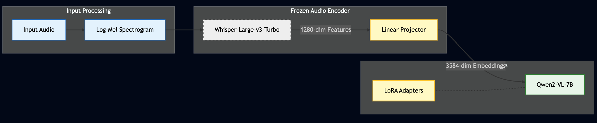
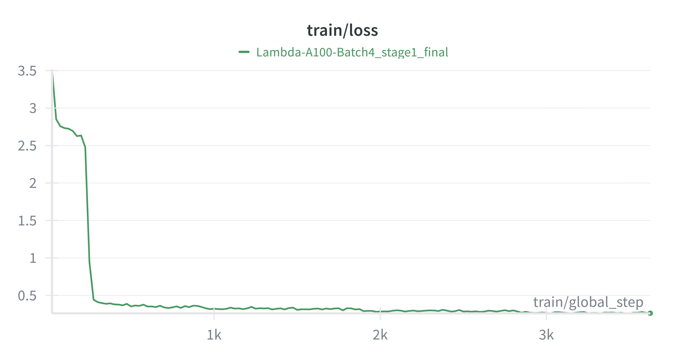
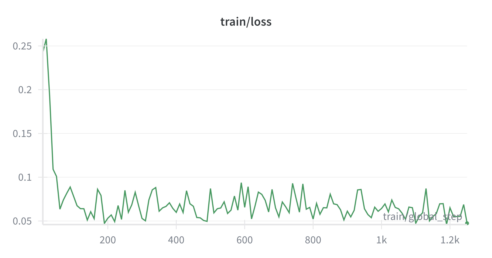
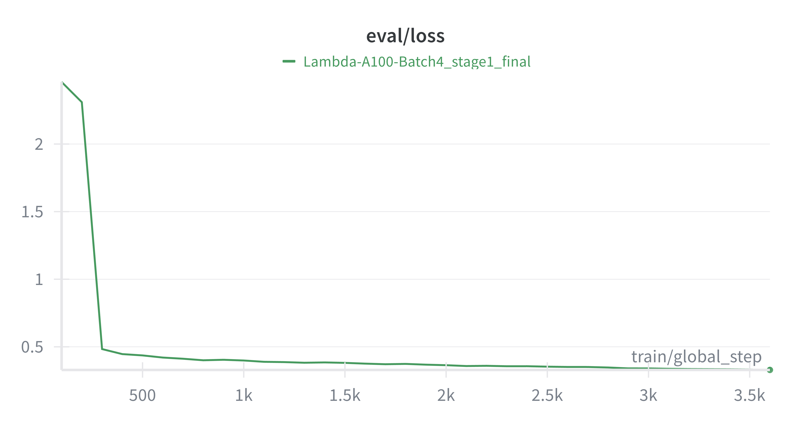
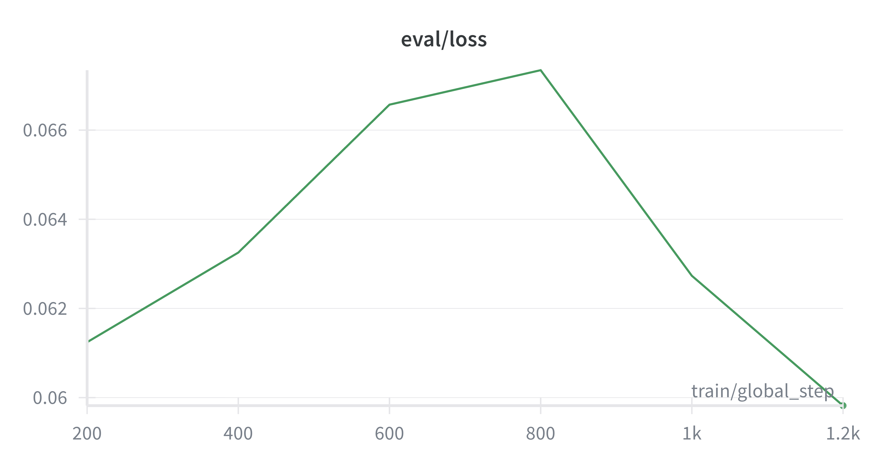
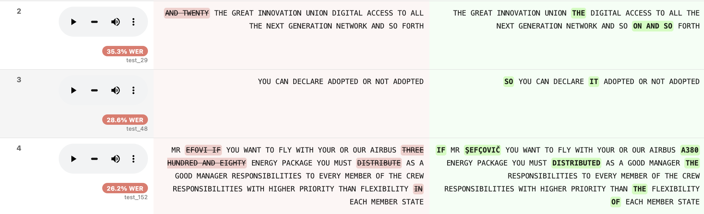

# Qwen2-VL-Audio-Adapter

> **Multimodal Fusion: Integrating Whisper Audio Encoder with Qwen2-VL for Production-Grade Speech Recognition**

[](https://huggingface.co/kulsoom-abdullah/Qwen2-Audio-7B-Transcription)
[](https://www.python.org/downloads/)
[](LICENSE)
[](https://huggingface.co/kulsoom-abdullah/Qwen2-Audio-7B-Transcription)

**Achieves commercial-grade ASR quality (WER 3.6% on Train, 7.3% on Unseen Test)** by fusing a Whisper-Large-v3-Turbo encoder with Qwen2-VL-7B using a two-stage training pipeline.

---

## 🎯 Project Overview

---
## 📑 Table of Contents
- [🎯 Project Overview & The "Why"](#-project-overview)
- [📊 Performance Highlights (The 36% Discovery)](#-performance-highlights)
- [🏗️ Architecture](#️-architecture)
- [🔬 Rigorous Audit: Label Noise & Semantic Bias](#-rigorous-audit-label-noise--semantic-bias-discovery)
- [📈 Training Dynamics](#-training-dynamics)
- [🚀 Quick Start & Inference](#-quick-start)
- [📂 Project Structure](#-project-structure)
---

This project demonstrates **audio adapter integration** — a technique for extending vision-language models with new modalities by:

1. **Fusing** a frozen Whisper audio encoder with Qwen2-VL-7B
2. **Stage 1**: Training a projector layer to align Whisper features (1280-dim) with Qwen embeddings (3584-dim)
3. **Stage 2**: QLoRA fine-tuning on instruction-following transcription data

### The "Why"

**Why use adapter fusion instead of training from scratch?**
- **Leverage Pretrained Reasoning**: Inherits the multimodal capabilities of Qwen2-VL-7B.
- **Reuse Robust Audio Features**: Uses the frozen Whisper-Large-v3-Turbo encoder (~640M params, encoder-only).
- **Compute Efficiency**: Achieves SOTA results with minimal compute (~18 hours total on single A100/RTX 6000).
- **Parameter Efficient**: Trains only 4.6M projector params + Rank-64 LoRA adapters.

---

## 📊 Performance Highlights

**Evaluation Context**: Tested on a held-out subset of 100 samples from the SpeechBrain test partition (English Parliamentary speech).

| Metric | Training Set | Test Set (Unseen) | Industry Standard |
|--------|-------------|-------------------|-------------------|
| **Word Error Rate (WER)** | **3.6%** | **7.3%** | 5-10% |
| **True WER (Label-Corrected)** | - | **~14%** | - |
| **Character Error Rate (CER)** | **2.5%** | **2.5%** | 3-5% |
| **Label Correction Rate** | - | **36%** | - |
| **Compute Efficiency** | **~18 GPU-hours** | - | Hundreds/Thousands |

**Qualitative Finding: Label Noise Robustness**
During error analysis, we observed that the model frequently **corrected ground-truth label errors** (e.g., fixing typos or missing articles present in the training transcripts). This suggests the model has learned robust phonetic mapping rather than just memorizing the dataset noise.

---

## 🏗️ Architecture


```

┌─────────────────────────────────────────────────┐
│  Whisper-Large-v3-Turbo Encoder (FROZEN)        │
│  ~640M params → 1280-dim audio features         │
└────────────────┬────────────────────────────────┘
│
↓
┌─────────────────────────────────────────────────┐
│  Audio Projector (Linear Layer)                 │
│  1280 → 3584 dims (4.6M trainable params)       │
└────────────────┬────────────────────────────────┘
│
↓
┌─────────────────────────────────────────────────┐
│  Qwen2-VL-7B LLM (QLoRA Fine-tuned)             │
│  7B params with rank-64 LoRA adapters           │
└─────────────────────────────────────────────────┘

```



## 📈 Training Dynamics

| **Stage 1: Projector Alignment** | **Stage 2: QLoRA Fine-Tuning** |
| :---: | :---: |
| **Train Loss** (Learning)<br> | **Train Loss** (Learning)<br> |
| **Eval Loss** (Generalization)<br> | **Eval Loss** (Generalization)<br> |

---

## 🔬 Rigorous Audit: Label Noise & Semantic Bias Discovery

To validate model quality on truly unseen data, we conducted a **blind manual audit** of 100 samples from the SpeechBrain test partition (never seen during training).

### 🔎 Audit Visualizer
Because GitHub restricts interactive JavaScript/CSS, we have captured static highlights of the audit below.

**1. Label Noise & Entity Resolution**
*The model (Green) correctly identified "Mr. Šefčovič" (Maroš Šefčovič, EU Commissioner), correcting the ground truth "Mr. Efovi" (Red). It also fixed missing words and grammar.*


**2. Semantic Bias & Long-Range Context**
*The model "hallucinated" the word "Malta" (Green) in the first sentence because it attended to the context provided later in the audio. While technically a WER error, this proves the model is performing editorial reasoning rather than literal transcription.*


### 📂 Detailed Reports

### 📂 Detailed Reports
* [**▶️ View Interactive Notebook (nbviewer)**](https://nbviewer.org/github/kulsoom-abdullah/Qwen2-VL-Audio-Adapter/blob/main/notebooks/01_View_Results_Highlighted.ipynb) *(Recommended: Renders colors/diffs correctly)*
* [**View Source Code on GitHub**](notebooks/01_View_Results_Highlighted.ipynb)
* **Full HTML Report:** Download [01_View_Results_Highlighted.html](notebooks/01_View_Results_Highlighted.html) to view the complete table locally.

### Quantitative Analysis

**Audit Results (100 Unseen Samples):**

| Category | Count | Percentage | Description |
|----------|-------|------------|-------------|
| **✅ Label Noise (Model Correct)** | 36 | **36%** | Model outperformed ground truth annotations |
| **❌ True Model Errors** | 14 | 14% | Model genuinely misheard or hallucinated |
| **⚠️ Ambiguous/Both Wrong** | 11 | 11% | Heavy accents, unclear audio, or both incorrect |
| **ℹ️ Normalization Differences** | 1 | 1% | Punctuation/formatting differences |
| **✓ Perfect Matches** | 37 | 37% | Exact agreement with ground truth |

**Key Insight:** In 36 out of 100 test samples, the model's transcription was more accurate than the human-annotated ground truth, revealing systematic annotation errors including:
- Missing or incorrect words
- Name misspellings (e.g., "Šefčovič" → "Efovi")
- Grammatical errors in labels
- Disfluency artifacts incorrectly transcribed

### Qualitative Discovery: Semantic Bias

Beyond simple acoustic transcription, the model exhibits **context-aware semantic reasoning** inherited from its LLM backbone. Unlike traditional ASR systems that transcribe verbatim, this adapter uses bidirectional context to perform "editorial" transcription—prioritizing sentence meaning over literal utterances.

**Case Study: The "Prime Minister of Malta" Hallucination**

| Component | Content |
|-----------|---------|
| **Audio** | *"I want to pay tribute to the Prime Minister of **yeah**... [sentence continues about Malta]"* |
| **Ground Truth** | *"Prime Minister of yeah"* (Literal transcription of disfluency) |
| **Model Prediction** | *"Prime Minister of **Malta**"* |
| **Analysis** | Model attended to "Malta" mentioned later in the sequence and used it to retroactively resolve the disfluency ("yeah"), demonstrating long-range contextual reasoning |

**Implication:** While technically a transcription error by WER metrics, this behavior demonstrates **semantic bias**—the model acts as an intelligent editor, leveraging the LLM's understanding to construct *intended meaning* rather than just *uttered sounds*. This is a feature, not a bug, for applications requiring clean, contextually-aware transcriptions.

---

## 🚀 Quick Start

### Installation

```bash
# 1. Clone the repository
git clone https://github.com/kulsoom-abdullah/Qwen2-VL-Audio-Adapter.git
cd Qwen2-VL-Audio-Adapter

# 2. Install Python dependencies
pip install -r requirements.txt

# 3. Install the custom Transformers fork
# (Required: Contains the modified Qwen2VL source code for Audio Adapter integration)
pip install -e transformers_fork/

```

### Inference

**Option A: Command Line (Fast)**
Transcribe an audio file using the custom script:

```bash
python scripts/inference.py --audio your_audio.wav

```

**Option B: Interactive Notebook (Exploratory)**
For deep analysis, visualization, and error checking:
**`notebooks/02_Test_Custom_Audio.ipynb`**

This notebook handles:

1. Loading the Base Model + Stage 2 Adapters.
2. Resampling your audio to 16kHz.
3. Running the generation pipeline with visualization.

**Command Line Evaluation (Test Set):**
To reproduce the WER/CER metrics on the full test dataset:

```bash
python scripts/05_evaluate.py

```

---

## 📁 Project Structure

```text
Qwen2-VL-Audio-Adapter/
├── README.md                      # This file
├── requirements.txt               # Python dependencies
│
├── scripts/                       # End-to-end training pipeline
│   ├── 00_graft_architecture.py   # Initial audio adapter setup
│   ├── 01_prepare_data.py         # Dataset preparation
│   ├── 02_train_stage1.py         # Stage 1: Projector training
│   ├── 03_check_stage1.py         # Stage 1 validation
│   ├── 04_train_stage2.py         # Stage 2: QLoRA fine-tuning
│   ├── 05_evaluate.py             # Final evaluation script
│   ├── setup_audit_data.py        # Downloads unseen test set (SpeechBrain)
│   ├── generate_audit_batch.py    # Generates audit results for verification
│   ├── inference.py               # CLI inference script
│   └── upload_to_hf.py            # HuggingFace upload utility
│
├── notebooks/                     # Interactive demos & analysis
│   ├── 00_Project_Walkthrough_and_Concepts.ipynb  # Deep dive into methodology
│   ├── 01_View_Results_Highlighted.ipynb          # Error analysis with audio playback
│   └── 02_Test_Custom_Audio.ipynb                 # Test with your own recordings
│
├── tests/                         # Validation & sanity checks
│   ├── test_audio_sensitivity.py  # Verify audio affects output
│   ├── test_generate_fix.py       # Validate .generate() works
│   ├── test_nano_inference.py     # Quick inference test
│   ├── test_processing_qwen2_vl.py # Verify processor logic
│   └── test_vision_process_local.py # Regression test for vision capabilities
│
├── docs/                          # Technical documentation
│   ├── architecture_deep_dive.md  # Theory behind the audio adapter integration
│   ├── engineering_log.md         # Daily dev log & decisions
│   ├── MODELING_QWEN2_VL_CHANGES.md       # Modifications to modeling_qwen2_vl.py
│   ├── PROCESSING_QWEN2_VL_CHANGES.md     # Modifications to processing_qwen2_vl.py
│   └── VISION_PROCESS_CHANGES.md          # Modifications to image handling
│
├── figures/                       # Architecture diagrams & plots
├── transformers_fork/             # Modified HuggingFace transformers source
└── output/                        # Training artifacts & results
```

---

## Notebook Descriptions

1. **`00_Project_Walkthrough_and_Concepts.ipynb`**
* End-to-end project narrative
* Dataset EDA and statistics
* Whisper architecture analysis (30s truncation proof)
* Teacher forcing vs autoregressive training
* Weight comparison between stages


2. **`01_View_Results_Highlighted.ipynb`**
* Word-by-word diff analysis with audio playback
* Error pattern analysis
* Label noise discovery (model corrects dataset errors!)
* Performance metrics visualization


3. **`02_Test_Custom_Audio.ipynb`**
* Record audio on Mac (Voice Memos)
* Audio preprocessing (16kHz resampling)
* Full inference pipeline
* Test with different instructions


---

## 🔬 Tech Stack

* **Framework**: PyTorch 2.4+
* **Transformers**: Custom fork of HuggingFace Transformers 4.45.2
* Modified `Qwen2VLForConditionalGeneration` for audio adapter integration
* Updated `prepare_inputs_for_generation()` for `.generate()` support
* Custom processor for audio token handling


* **PEFT**: 4-bit QLoRA (rank-64, alpha-128) for memory-efficient fine-tuning
* **Audio**: Librosa + torchaudio + Whisper feature extraction
* **Monitoring**: Weights & Biases for experiment tracking
* **Hardware**: NVIDIA A100 40GB and RTX 6000 Ada (Lambda Labs / RunPod)

---

## 🧪 Training Details

### Hardware & Environment

* **Hardware**: NVIDIA RTX 6000 Ada / A100 40GB (Lambda Labs/RunPod)
* **Framework**: PyTorch 2.4+, Transformers (Custom Fork), PEFT
* **Precision**: BFloat16 with Flash Attention 2

### Stage 1: Audio Projector Alignment

**Objective**: Align Whisper audio features with Qwen2-VL embedding space.

| Parameter | Value |
| --- | --- |
| **Trainable** | Audio Projector only (4.6M params) |
| **Frozen** | Audio Encoder + LLM (~8.5B params) |
| **Dataset** | ~20,000 samples (SpeechBrain ASR) |
| **Duration** | ~12 hours |
| **Final Loss** | ~0.30 (Converged) |
| **Optimizer** | AdamW (lr=1e-3, High LR for initialization) |

### Stage 2: QLoRA Fine-Tuning

**Objective**: Teach the model to follow transcription instructions.

| Parameter | Value |
| --- | --- |
| **Trainable** | Projector + LLM Adapters (Rank-64) |
| **Frozen** | Audio Encoder |
| **Dataset** | ~20,000 samples |
| **Duration** | ~6 hours |
| **Final Loss** | ~0.06 (Highly accurate) |
| **Technique** | 4-bit QLoRA (BitsAndBytes) |

**Critical Implementation Details:**

* **Regex-based LoRA Targeting**: Specifically targets Qwen2 attention (`q_proj`, `v_proj`, etc.) and MLP layers while strictly avoiding the frozen Whisper encoder to prevent catastrophic forgetting.
```python
target_modules_regex=r"model\.layers\.\d+\.(self_attn\.(q|k|v|o)_proj|mlp\.(gate|up|down)_proj)"

```


* **Custom `.generate()` Support**: Patched `transformers` source code (3 specific edits) to pass audio features through the KV-cache generation loop.
* **Adapter Merging**: LoRA weights were merged into the base model before saving to ensure inference stability without complex adapter loading logic.

---

## 🔧 Custom Transformers Fork

**Why a fork?** The standard Qwen2-VL architecture does not natively support audio embedding injection.

**Key Source Code Modifications** (see `docs/MODELING_QWEN2_VL_CHANGES.md`):

1. **`__init__()`**: Initialized the Whisper-Large-v3-Turbo encoder and the trainable Linear Projector (1280 → 3584 dim).
2. **`forward()`**: Modified the forward pass to intercept `input_features`, project them, and swap them into the token sequence at `<|audio_pad|>` indices.
3. **`.generate()`**: Patched `prepare_inputs_for_generation` to accept audio features and handle caching correctly during autoregressive decoding.

---

## 🎓 Key Learnings

1. **Label Noise Detection**: At <4% WER, the model began outperforming the ground truth labels, frequently correcting typos and missing articles in the original SpeechBrain dataset.
2. **Adapter Viability**: Proved that a simple Linear Projector is sufficient to bridge a ~640M parameter Audio Encoder to a 7B LLM without retraining the backbones from scratch.
3. **The Importance of LoRA Targeting**: Precise regex targeting was required to ensure LoRA adapters attached *only* to the LLM layers. Accidental training of the frozen audio encoder results in catastrophic feature collapse.

---

## 🚧 Known Limitations

* **Context Window**: Audio input is hard-capped at ~30 seconds (1500 tokens).
* **Domain Specificity**: High performance on formal/parliamentary speech; untested on noisy or conversational audio.
* **Dependency**: Inference requires the custom `transformers_fork` included in this repository.

---

## 📝 Citation
```bibtex
@misc{qwen2-vl-audio-adapter,  
  author = {Kulsoom Abdullah},
  title = {Qwen2-VL-Audio-Adapter: Multimodal Projection Alignment for Speech Recognition},
  year = {2026},
  publisher = {GitHub},
  howpublished = {\url{https://github.com/kulsoom-abdullah/Qwen2-VL-Audio-Adapter}}
}


```

---

## 🙏 Acknowledgments

* **Qwen Team** @ Alibaba Cloud for [Qwen2-VL-7B-Instruct](https://huggingface.co/Qwen/Qwen2-VL-7B-Instruct)
* **OpenAI** for [Whisper-Large-v3-Turbo](https://huggingface.co/openai/whisper-large-v3-turbo)
* **SpeechBrain** for [LargeScaleASR dataset](https://huggingface.co/datasets/speechbrain/LargeScaleASR)
* **LLaVA** team for pioneering visual instruction tuning methodology

---

## 📄 License

Apache 2.0 (inherits from Qwen2-VL and Whisper)

---

## 🔗 Links

* **Trained Model**: [HuggingFace Hub](https://huggingface.co/kulsoom-abdullah/Qwen2-Audio-7B-Transcription)
* **Stage 1 Checkpoint**: [HuggingFace Hub](https://huggingface.co/kulsoom-abdullah/Qwen2-Audio-Stage1)
* **Grafted Checkpoint**: [HuggingFace Hub](https://huggingface.co/kulsoom-abdullah/qwen2-vl-audio-graft)

---

**Built with 🧠 + ☕ + 🎧 by [Kulsoom Abdullah**](https://linkedin.com/in/kulsoom-abdullah)
